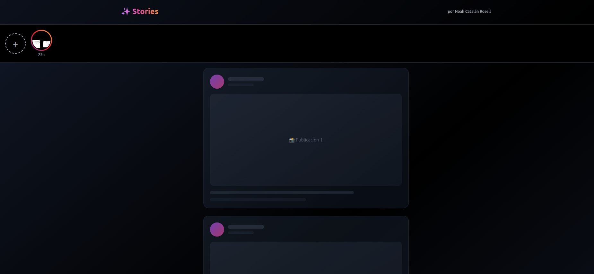
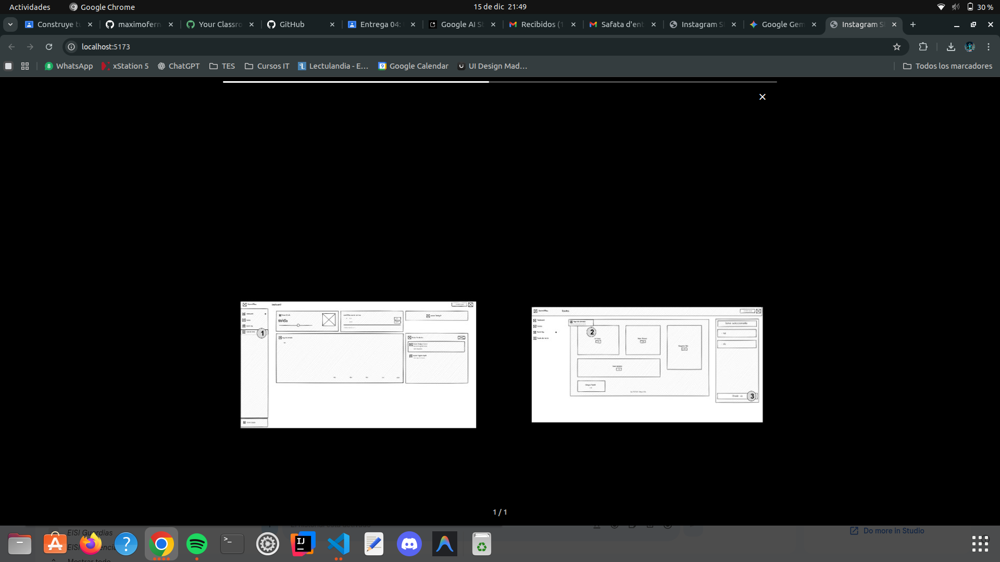

# Instagram Stories Clone - Proyecto Final

**Desarrollado por:** Noah Catalán Rosell  
**Fecha:** Diciembre 2025  
**Curso:** Desarrollo Web

---

## 📱 ¿Qué es este proyecto?

Hola! Soy Noah Catalán y este es mi proyecto de clon de Instagram Stories. Básicamente he creado una aplicación web que funciona como las historias de Instagram: puedes subir fotos, verlas en pantalla completa, y se borran solas después de 24 horas.

Lo mejor de todo es que funciona completamente en el navegador, sin necesidad de un servidor o base de datos externa. Todo se guarda en el LocalStorage del navegador.

---

## 🚀 Cómo levantar la aplicación

### Requisitos previos
- Tener Node.js instalado (yo usé la versión 18)
- npm (viene con Node.js)

### Pasos para ejecutar:

1. **Abrir la terminal** en la carpeta del proyecto

2. **Instalar dependencias:**
   ```bash
   npm install
   ```
   Esto descarga todas las librerías necesarias (React, TypeScript, Tailwind, etc.)

3. **Iniciar el servidor de desarrollo:**
   ```bash
   npm run dev
   ```

4. **Abrir el navegador:**
   - Ve a `http://localhost:5173/`
   - ¡Ya está funcionando!

### Para crear la versión de producción:
```bash
npm run build
```
Esto genera los archivos optimizados en la carpeta `dist/`

---

## 🎨 Cambios que realicé

### Diseño Visual Moderno

**Header renovado:**
- Puse un gradiente de fondo sutil (de gris oscuro a negro)
- El título "Stories" tiene un degradado de colores (púrpura → rosa → naranja) con un emoji
- Añadí mi nombre "Noah Catalán Rosell" en la esquina superior derecha, pequeñito pero visible

**Feed actualizado:**
- Las tarjetas ahora tienen bordes semi-transparentes y sombras suaves
- Los avatares tienen gradientes con animación de "pulse"
- Todo está centrado con un ancho máximo para mejor visualización
- Las esquinas son más redondeadas (más moderno)
- Efectos hover más elegantes

**Fondo general:**
- Gradiente diagonal que da sensación de profundidad
- Colores oscuros para que las historias destaquen

### Funcionalidades implementadas

✅ **Subir historias:** Haces clic en el botón "+", seleccionas una imagen y aparece al instante  
✅ **Ver historias:** Click en cualquier círculo y se abre en pantalla completa  
✅ **Navegación intuitiva:**
   - Click derecho → siguiente historia
   - Click izquierdo → historia anterior
   - Mantener presionado → pausar
   - Flechas del teclado ← → para navegar
   - Escape para cerrar

✅ **Barra de progreso:** Indica cuánto falta para que pase a la siguiente (3 segundos cada una)  
✅ **Expiración automática:** Las historias se borran solas después de 24 horas  
✅ **Responsive:** Funciona tanto en móvil como en ordenador

---

## 🛠️ Tecnologías que usé

### React + TypeScript
La base de todo. React me permite crear componentes reutilizables y TypeScript me ayuda a evitar errores con los tipos de datos.

### Vite
Es como el "motor" que ejecuta la aplicación en desarrollo y la compila para producción. Es súper rápido comparado con otras herramientas.

### Tailwind CSS
Para los estilos. En vez de escribir CSS tradicional, uso clases tipo `bg-black` o `rounded-full`. Al principio es raro pero luego es muy rápido.

### LocalStorage (API del navegador)
Aquí guardo las historias. Es como una "caja" en el navegador donde puedo guardar texto. Convierto las imágenes a Base64 (un texto larguísimo) y las guardo ahí.

### FileReader y Canvas (APIs del navegador)
- **FileReader:** Para leer las imágenes que sube el usuario
- **Canvas:** Para hacer las imágenes más pequeñas y que no se llene el almacenamiento

---

## 📂 Estructura del proyecto

```
instagram-stories-clone/
├── src/
│   ├── components/          # Componentes visuales
│   │   ├── StoryList.tsx   # Lista de círculos de historias
│   │   ├── StoryViewer.tsx # Pantalla completa para ver historias
│   │   ├── StoryCircle.tsx # Cada círculo individual
│   │   ├── ProgressBar.tsx # Barra de progreso
│   │   └── AddStoryButton.tsx # Botón para subir historias
│   │
│   ├── hooks/              # Lógica reutilizable
│   │   ├── useStories.ts   # Maneja las historias (agregar, cargar, borrar)
│   │   └── useStoryViewer.ts # Maneja el visor (navegación, timers)
│   │
│   ├── utils/              # Funciones auxiliares
│   │   ├── storage.ts      # Guardar/leer del LocalStorage
│   │   └── imageUtils.ts   # Procesar y comprimir imágenes
│   │
│   ├── types/              # Definiciones de TypeScript
│   │   └── index.ts
│   │
│   ├── App.tsx             # Componente principal
│   └── main.tsx            # Punto de entrada
│
├── package.json            # Dependencias y scripts
└── vite.config.ts          # Configuración de Vite
```

---

## 💡 Lo que aprendí

### 1. React Hooks
Los hooks como `useState`, `useEffect`, `useCallback` y `useRef` son raros al principio, pero son muy potentes. El más complicado fue `useRef` para evitar problemas con los temporizadores.

### 2. Manejo de archivos en el navegador
Aprendí a usar `FileReader` para leer imágenes y `Canvas` para redimensionarlas. Fue complicado pero funciona bien.

### 3. LocalStorage tiene límites
Solo puedes guardar unos 5MB de datos. Por eso tengo que comprimir las imágenes antes de guardarlas.

### 4. Temporizadores en React
Usar `setTimeout` y `setInterval` en React es complicado porque tienes que limpiarlos bien. Si no, se crean "memory leaks" (pérdidas de memoria).

### 5. TypeScript vale la pena
Al principio me quejaba de tener que poner tipos a todo, pero me ahorró muchos errores tontos.

---

## 🎯 Problemas que resolví

**Problema:** Las historias no avanzaban automáticamente  
**Solución:** Usar `useRef` en vez de `useState` para ciertos valores

**Problema:** El LocalStorage se llenaba muy rápido  
**Solución:** Comprimir las imágenes a 1080x1920px máximo y calidad 85%

**Problema:** Los temporizadores seguían corriendo aunque cerrara el visor  
**Solución:** Limpiar los timers en el `return` del `useEffect`

**Problema:** Los gestos táctiles no funcionaban bien  
**Solución:** Calcular la distancia del swipe y solo contar como swipe si es mayor a 50px

---

## 🎥 Video de Presentación

A continuación puedes ver una demostración del proyecto funcionando:




> **Nota:** Si el video no se visualiza, puedes encontrarlo en el archivo `video-presentacion.mp4` en la raíz del proyecto.

---

## ✨ Características destacadas

- 📸 **Sin backend:** Todo funciona en el navegador
- ⏰ **24 horas:** Las historias expiran automáticamente
- 🎨 **Diseño moderno:** Gradientes, animaciones, efectos
- 👆 **Gestos intuitivos:** Tap, swipe, mantener presionado
- 📱 **Responsive:** Funciona en móvil y desktop
- ⚡ **Rápido:** Vite hace que todo sea instantáneo
- 🔒 **Type-safe:** TypeScript previene errores

---

## 🚀 ¿Qué podría mejorar?

Si tuviera más tiempo, añadiría:
- Soporte para videos (ahora solo imágenes)
- Filtros y stickers
- Sistema de múltiples usuarios
- Backend real para sincronizar entre dispositivos
- Respuestas a historias

---

## 📝 Conclusión

Este proyecto me enseñó muchísimo sobre React, TypeScript y las APIs del navegador. Al principio parecía imposible hacer algo tan complejo sin backend, pero dividiendo el problema en partes pequeñas lo conseguí.

Lo más importante que aprendí es que cuando algo parece muy difícil, solo hay que dividirlo en problemas más pequeños y resolverlos uno por uno.

---

**Noah Catalán Rosell**  
Instagram Stories Clone  
Diciembre 2025
